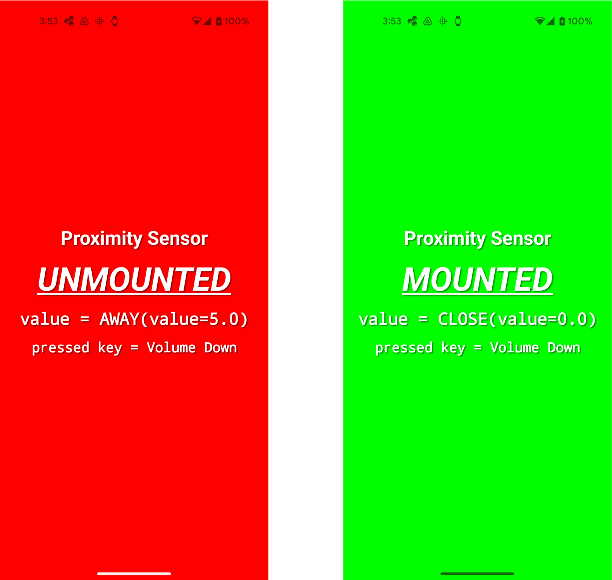

# thinklet.app.proximity-checker

近接センサーの状態変更を検知して音と画面表示で知らせるAndroidアプリ。
THINKLETでの装着有無の検知に好適ですが、一般的なAndroidスマートフォンでも利用できます。

## 開発時に使用したIDE

Android Studio Meerkat | 2024.3.1

## 使用方法

コードをビルドしてAndroidデバイスにインストールしたあとにできる操作は以下です。

- 近接センサーに物体を近づけたり離したりして近接センサーが反応したときにセンサー状態を示すの効果音を鳴らす
- ボリュームボタン（THINKLETの第1,3ボタン）の押下で効果音の音量を変更するとともに、押下時の近接センサー状態の効果音を鳴らす
- HWカメラボタン（THINKLETの第2ボタン）を押下すると押下時の近接センサー状態の効果音を鳴らす

## スクリーンショット

背景が赤色のときは近接センサーが反応していない状態、緑色が反応している状態を示す

## 参考

本リポジトリのコードでは、近接センサーからの情報取得を実装していますが、[THINKLET App SDK](https://github.com/FairyDevicesRD/thinklet.app.sdk)をご利用の場合は、SDKのAPIを利用することもできます。
